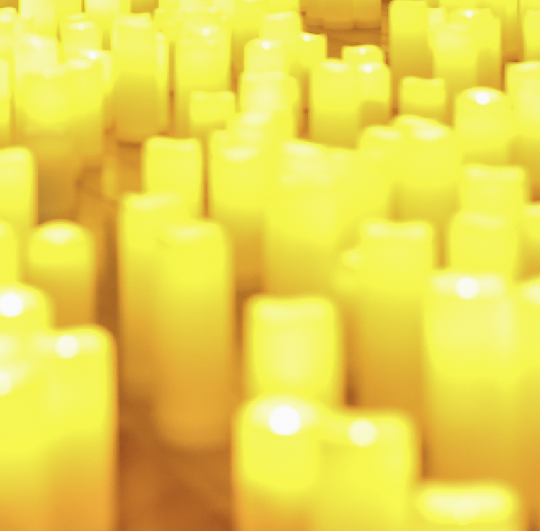

# Candlenight – Տարբերվող մթնոլորտային երեկո մոմերի լույսի ներքո (afterparty)

## Ի՞նչ է Candlenight-ը

Դա մեր հանդիպումից հետո կազմակերպվող ոչ ֆորմալ, հանգիստ ու մտերմիկ երեկոն է։  
Երբ ցերեկային ակտիվությունը ավարտվում է, մենք տեղափոխվում ենք նոր մթնոլորտ՝  
հարյուրավոր մոմերի, մեղմ երաժշտության և խորը զրույցների ներքո։

---

## 📍 Տեղը և Ժամը

- **Ժամը**՝ հանդիպումից հետո՝ մոտավորապես `21:00-ից`
- **Վայրը**՝ բացօթյա կամ փակ մթնոլորտային տարածք (կախված եղանակից)

---

## ✨ Ինչ է սպասվում

- 🕯 **Հարյուրավոր վառված մոմեր**՝ տարածքի ամբողջական լուսավորում
- 🎶 **Մեղմ երաժշտություն**՝ ջազ կամ ինսթրումենտալ նվագարանային ֆոն
- 🍷 **Թեթև հյուրասիրություն**՝ թեյ, գինի, մի փոքր քաղցրավենիք
- 📸 **Լուսանկարների անկյուն**՝ լուսանկարվելու մոմերի հետ

---

## 📣 Ում համար է

- Նրանք, ովքեր ուզում են երկարացնել օրը
- Նրանք, ովքեր սիրում են գեղեցիկ մթնոլորտներ
- Նրանք, ովքեր հոգնել են բարձր երաժշտությամբ afterparty-ներից
  և ցանկանում են լինել ավելի հանգիստ միջավայր

---

Մնացած մանրամասները: TBD (to be discussed)

